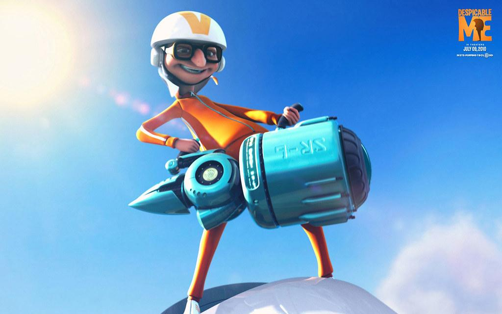

# MÆV

## Authors
Ethan Hoyt, Dawson Ochs, Dayne Pefley, Sterling Davis

## Getting started
Check out our [wiki on Gitlab](https://repo.cse.taylor.edu/dpefley/maev/-/wikis/home)!

## Building and Running the Engine

The process to build and run the engine should be completely automated by the Makefile in the `build` directory.
How you run the Makefile will change depending on what computer you are building it on. Our engine uses Python 3.12, SFML 3.0.0, and FLAC 12 which coincidentally the CSE machines do not have installed. In light of that situation, we have manually included those dependencies and added a way to run the make command for Python 3.10 (which the CSE machines do have).

Once you have all the files installed, simply run the following for the default build:
```
make
```
For the CSE lab machine installation, simply run the following instead:
```
make ENV=lab
```

After building the next step is to run a game! Our make file has a `run` option that will also try to build the engine before running it.
```
make run
```
This will run the default testing game that can be found at games/testing/game.py

If you want to run your own game, you will have to manually add the full path to the FLAC/lib directory in the same command (so that the change is only temporary). For example, running the platformer game would have to run the following from the command line:
```
LD_LIBRARY_PATH="/full_path_to/FLAC/lib:$LD_LIBRARY_PATH" ./engine /full_path_to/games/platformer platformer.py
```

> It's not the best solution we have, but is the only way we found to get it to work on the CSE lab machines.

## Integrate with your tools
- [ ] [Set up project integrations](https://repo.cse.taylor.edu/dpefley/maev/-/settings/integrations)

## Collaborate with your team

## Test and Deploy

## Name
The MAEV (Mass-Velocity) Engine

## Description
A game engine written in C++ that intends to think of everything in terms of sprites and vectors. This allows for robust collision detection and kinematics-based physics that is simple to implement.
These features will be represented with several examples:
	- A top-down racing game that can use vectors to simulate velocity, acceleration, car collision, etc.
	- A side-scrolling 2D platformer that can use vectors to invert gravity and forces
	- A top-down stealth-action game that can use vectors to calculate line-of-sight, bullet trajectory and reflections, etc.
	- A side-scrolling Metroidvania that can use vectors to implement attack rebounding

## Visuals

## Installation

## Usage

## Roadmap

## Inspiration

